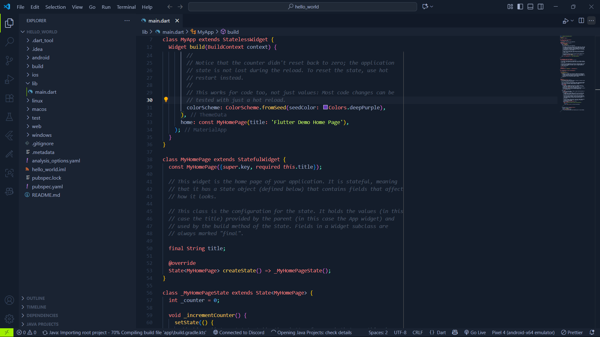
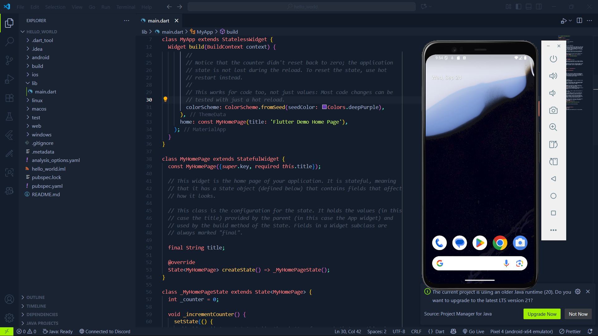
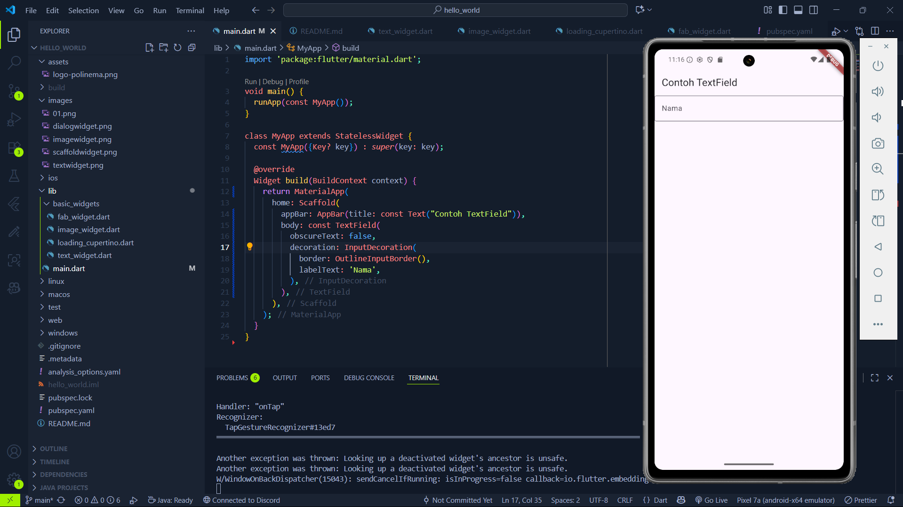
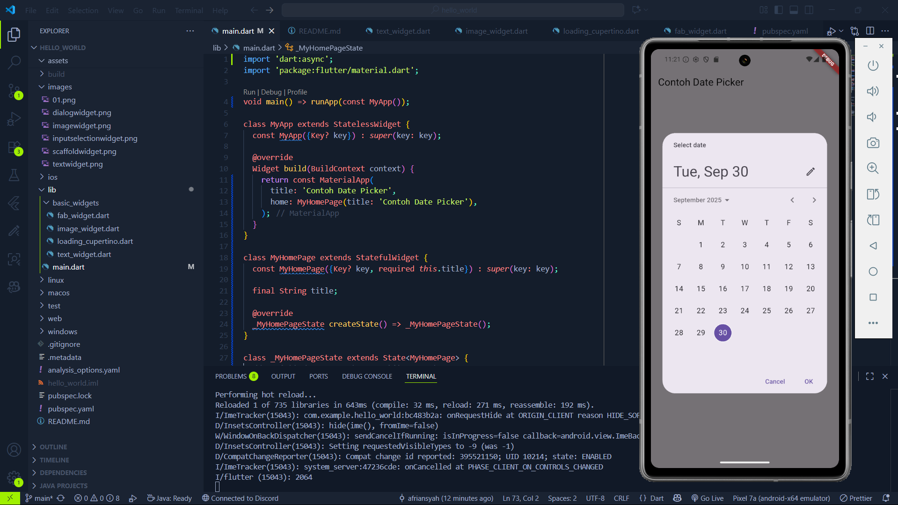

# 📱 Praktikum Flutter — Hello World & Widget Dasar  

**Mata Kuliah:** Pemrograman Mobile  
**Dosen Pengampu:** Ade Ismail, S.Kom., M.TI  
**Nama:** Alfin Afriansyah  
**NIM:** 2341760089  
**Kelas:** SIB 3C  

---

## 📌 Praktikum 1: Membuat Project Flutter Baru
- Membuat project `hello_world` dengan **VS Code**.  
- Struktur project berhasil dibuat dengan pesan: `Your Flutter Project is ready!`.  
- Output awal adalah aplikasi counter bawaan Flutter.  

📷 **Screenshot:**  

---

## 📌 Praktikum 2: Menjalankan Aplikasi di Emulator & Perangkat Fisik
- Aplikasi dijalankan pada **emulator Android** dan **device fisik (HP Android)**.  
- Nama & NIM ditampilkan pada tampilan aplikasi untuk identitas.  

📷 **Screenshot Emulator:**  

---

## 📌 Praktikum 3: Integrasi GitHub & Dokumentasi
- Membuat repository GitHub: `flutter-fundamental-part1`.  
- Melakukan **init, add remote, commit, push** dari VS Code.  
- Semua file (source + README + screenshot) sudah terdokumentasi.  

📷 **Screenshot:**  

---

## 📌 Praktikum 4: Widget Dasar
### 🔹 Langkah 1 — Text Widget
Menampilkan teks dengan gaya warna merah dan ukuran font 14.  

📷 **Screenshot:**  
  

### 🔹 Langkah 2 — Image Widget
Menampilkan gambar dari `assets/logo_polinema.jpg`.  

📷 **Screenshot:**  
  

---

## 📌 Praktikum 5: Widget Material Design & Cupertino

### 🔹 Langkah 3 — Scaffold Widget  
📷 **Screenshot:**  
  

### 🔹 Langkah 4 — Dialog Widget  
📷 **Screenshot:**  
  

### 🔹 Langkah 5 — Input & Selection (TextField)  
📷 **Screenshot:**  
  

### 🔹 Langkah 6 — Date Picker  
📷 **Screenshot:**  
  